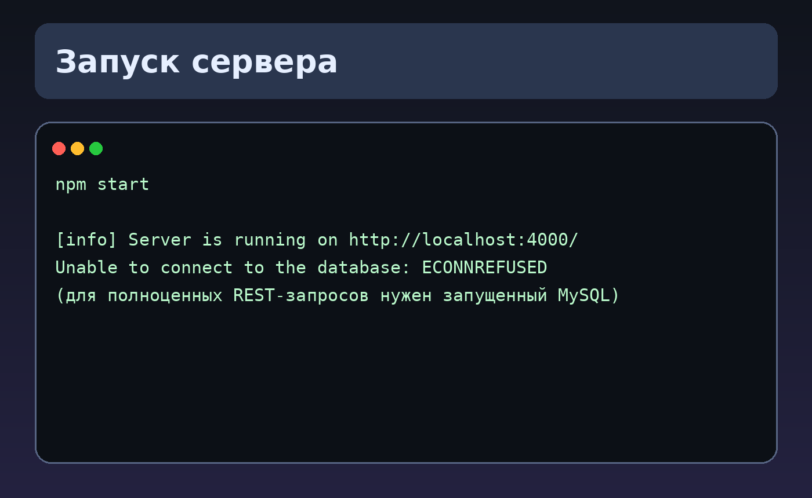
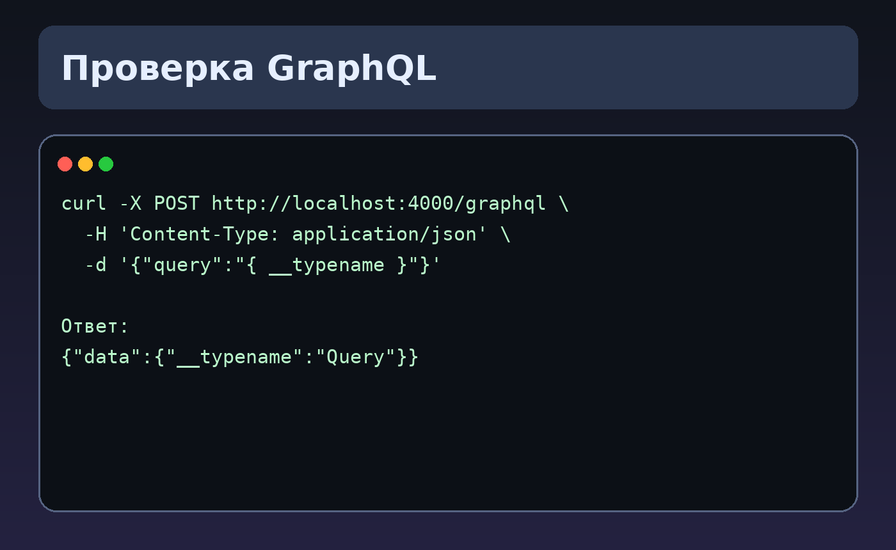
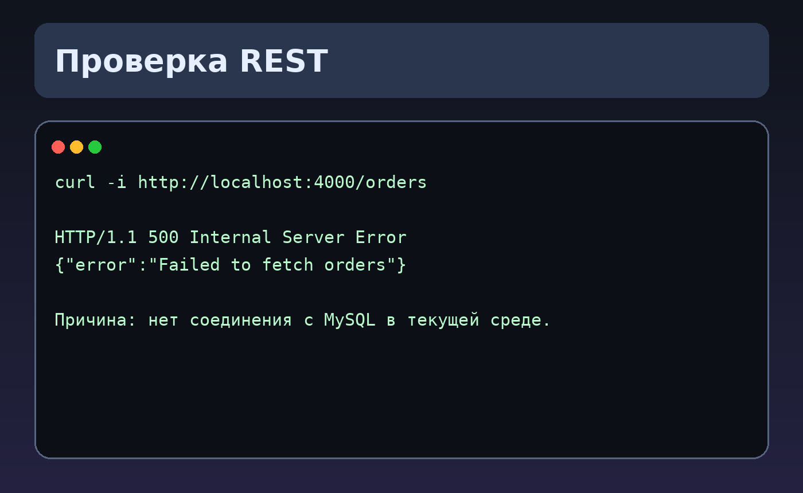

# 🚗 CRUD: управление авто и заказами (REST + GraphQL)

Небольшой backend-проект на **Node.js + Express + Sequelize + MySQL**.  
Приложение позволяет:

- работать с заказами (создание, получение, смена статуса, отмена) через **REST API**;
- работать со справочником автомобилей через **REST** и **GraphQL**;
- фильтровать/сортировать авто и получать агрегаты продаж по модели.

---

## 🧱 Стек

- Node.js
- Express
- Sequelize
- MySQL
- Apollo Server (GraphQL)
- Joi (валидация)
- Winston (логирование)

---

## 📂 Структура проекта

- `/src/app.js` — точка входа, запуск Express и GraphQL
- `/src/routes` — REST-маршруты
- `/src/controllers` — обработчики запросов
- `/src/usecase` — бизнес-логика
- `/src/repository` — доступ к БД
- `/src/models` — Sequelize-модели
- `/src/graphql` — схема и резолверы GraphQL
- `/src/migrations`, `/src/seeders` — миграции и сиды

---

## ⚙️ Как это работает

1. Запускается HTTP-сервер на `PORT` (по умолчанию `4000`).
2. REST-роуты подключаются из `routes`.
3. GraphQL endpoint поднимается на `POST /graphql`.
4. Данные читаются/записываются через Sequelize в MySQL.
5. Логи пишутся в консоль и файл `app.log`.

---

## 🚀 Как запустить

### 1) Установить зависимости

```bash
npm install
```

### 2) Настроить `.env`

Пример:

```env
PORT=4000
DB_HOST=localhost
DB_USER=root
DB_PASSWORD=123123
DB_NAME=crudlabdb
```

### 3) Поднять MySQL и создать БД

Создайте БД `crudlabdb` (или укажите свою в `.env`).

### 4) Применить миграции и (опционально) сиды

```bash
npx sequelize-cli db:migrate --migrations-path src/migrations
npx sequelize-cli db:seed:all --seeders-path src/seeders
```

### 5) Запустить сервер

```bash
npm start
```

Сервер: `http://localhost:4000`

---

## 🔌 API

### REST

- `POST /createOrder` — создать заказ
- `GET /orders` — получить список заказов
- `GET /checkStatus/:orderId` — проверить статус заказа
- `PUT /changeStatus/:orderId` — изменить статус
- `PUT /cancelOrder/:orderId` — отменить заказ
- `GET /getList` — получить список автомобилей

### GraphQL

Endpoint: `POST /graphql`

Основные запросы/мутации:

- `getCars(filter, sortBy, sortOrder)`
- `getCarById(id)`
- `getCarSalesCount(modelName)`
- `createAuto(input)`
- `updateAuto(id, input)`
- `deleteAuto(id)`

---

## 🖼 Скриншоты

### Запуск сервера


### Проверка GraphQL


### Проверка REST


---

## 📝 Что проверено локально

- `npm install` — успешно
- `npm start` — сервер запускается на `:4000`
- GraphQL-запрос `{"query":"{ __typename }"}` — успешно

В текущей среде MySQL не был запущен, поэтому REST-методы, требующие БД, возвращают ошибку подключения.  
С поднятой MySQL и выполненными миграциями/сидами проект работает в штатном режиме.